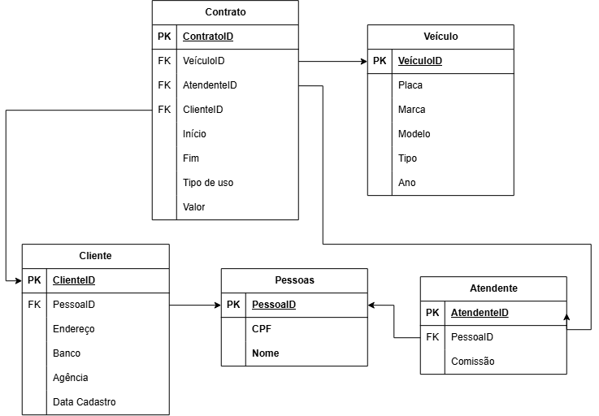

Alunos: Thales Miguel Yoshida Fortes, Nicolas de Oliveira Franco, Judson Gabriel, Gilvan Felipe.

# **Aluguel de Carros**

## **Apresentação do Projeto**
  Este projeto tem como objetivo desenvolver um banco de dados para um sistema de aluguel de veículos, voltado principalmente para motoristas que trabalham com aplicativos de transporte e necessitam de um veículo para exercer suas atividades.
  O  sistema permite o gerenciamento das principais informações relacionadas à empresa de aluguel, incluindo clientes, atendentes, veículos e contratos de aluguel. Também possibilita registrar os veículos disponíveis, seus dados de identificação e características, além de controlar os contratos realizados, seus respectivos períodos de validade e formas de pagamento.
  A estrutura foi desenvolvida utilizando um modelo relacional, buscando garantir a organização dos dados, a integridade das informações e o correto relacionamento entre as diferentes entidades do sistema.

## **Objetivo Geral**
  Desenvolver um banco de dados capaz de auxiliar no gerenciamento de uma empresa de aluguel de veículos, permitindo organizar e controlar os cadastros de clientes e atendentes, os veículos disponíveis e os contratos de aluguel realizados.

## **Público-Alvo**
  O sistema é destinado principalmente a empresas de aluguel de veículos que atendem motoristas de aplicativos, oferecendo uma estrutura para organizar seus dados e facilitar o controle das locações e dos clientes.
  Também pode ser utilizado como base para sistemas de gerenciamento de locadoras que necessitem controlar diferentes tipos de veículos e seus respectivos contratos de aluguel.

## **Modelo de Dados**
  O diagrama abaixo representa o modelo relacional desenvolvido para o sistema, apresentando as principais entidades, seus atributos e os relacionamentos existentes entre elas.

